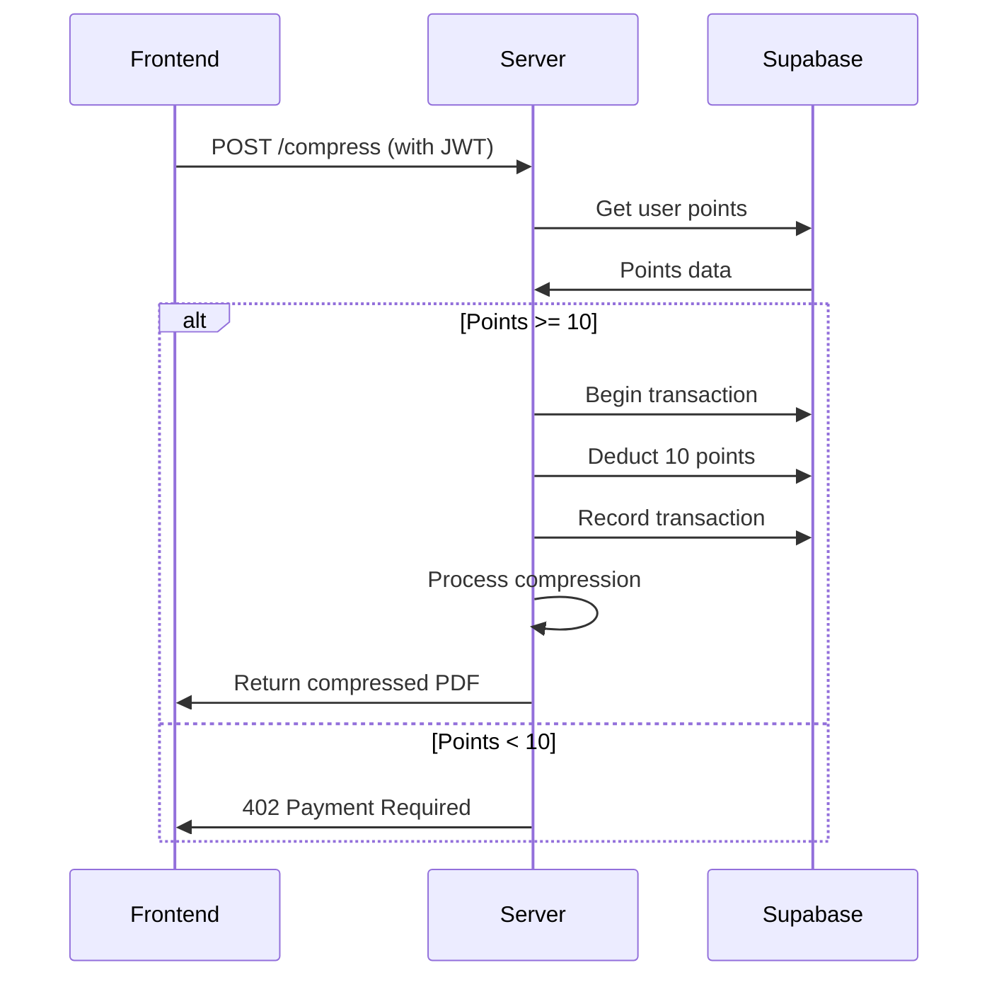

# PDF Points System Design Specification

## 1. Overview

This document specifies the implementation of the points-based payment system for the PDF compression tool as described in the product requirements. The system will allow:
- Anonymous user sessions with initial 10-point balance
- Email verification for account recovery
- Points deduction for compression operations
- Redeem code-based point top-ups

## 2. Architecture

### 2.1 Server Integration

Modifications to existing `server.js`:

```javascript
// Add after existing dependencies
const { createClient } = require('@supabase/supabase-js');
const crypto = require('crypto');
const resend = require('resend').Resend;

// Initialize Supabase
const supabase = createClient(
  process.env.SUPABASE_URL, 
  process.env.SUPABASE_KEY
);

// Initialize Resend
const resendClient = new resend({ apiKey: process.env.RESEND_API_KEY });

// Session management middleware
const authenticate = async (req) => {
  const token = req.headers.authorization?.replace('Bearer ', '');
  if (!token) return null;
  
  try {
    const { data: { user }, error } = await supabase.auth.getUser(token);
    return error ? null : user;
  } catch (e) {
    return null;
  }
};
```

### 2.2 New API Endpoints

| Endpoint | Method | Purpose |
|----------|--------|---------|
| `/api/auth/anonymous` | POST | Creates anonymous session with 10 points |
| `/api/auth/send-code` | POST | Sends email verification code |
| `/api/auth/verify-code` | POST | Links email to session |
| `/api/user` | GET | Returns current user points |
| `/api/redeem` | POST | Processes redeem codes |
| `/api/consume` | POST | Deducts points for compression |

## 3. Database Schema

Existing Supabase tables (pre-configured):

**users**
- id (UUID)
- email (text, nullable)
- device_id (text)
- points (integer, default 10)
- created_at (timestamp)
- updated_at (timestamp)

**transactions**
- id (UUID)
- user_id (UUID)
- type (text: gift/consume/redeem)
- points (integer)
- balance_after (integer)
- remark (text)
- created_at (timestamp)

**redeem_codes**
- id (UUID)
- code (text, unique)
- points (integer)
- used (boolean, default false)
- used_by (UUID, nullable)
- used_at (timestamp, nullable)
- created_at (timestamp)

## 4. Key Implementation Details

### 4.1 PDF Compression Flow



### 4.2 Security Measures

- All point calculations server-side only
- JWT validation on all protected endpoints
- Rate limiting: 5 requests/minute per IP on auth endpoints
- Transaction isolation for point deduction
- Redeem code one-time usage enforcement

## 5. Frontend Modifications

### 5.1 UI Components

- Points display in header (real-time)
- Redeem code modal (triggered when points < 10)
- Email verification prompt after initial use

### 5.2 Session Flow

```plaintext
[User opens site] → [Create anonymous session] → [Points: 10 displayed]
↓
[Upload PDF] → [Check points via /api/user] → [Deduct 10] → [Process]
```

## 6. Implementation Timeline

1. **Phase 1 (2 hours)**: Set up Supabase client and authentication endpoints
2. **Phase 2 (3 hours)**: Implement points deduction workflow
3. **Phase 3 (2 hours)**: Add redeem code functionality
4. **Phase 4 (1 hour)**: UI integration and testing

## 7. Verification Steps

Before marking complete:
- [ ] Anonymous user gets 10 points on first visit
- [ ] PDF compression consumes 10 points
- [ ] Points display updates in real-time
- [ ] Redeem codes add points correctly
- [ ] Email verification links accounts properly

---

*Spec self-reviewed for completeness. No placeholders or contradictions found.*